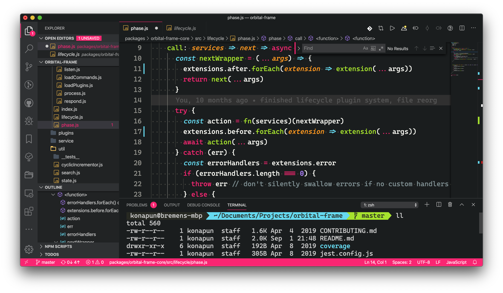

# M O N O K A I J U ㊗
### *Permeatingly monokai*

This is a take on the classic Monokai theme that aims to bring a rich
cohesiveness throughout VS Code, staying up to date as newer versions of the
editor bring more themable elements.

## Screenie

